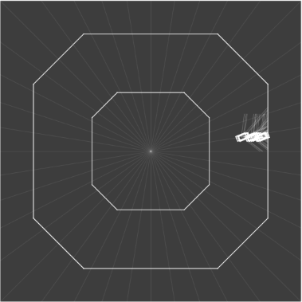
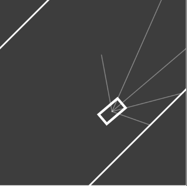
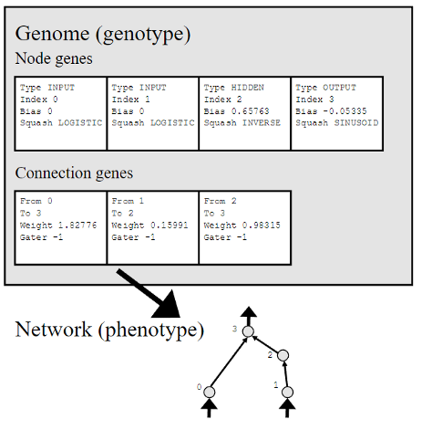
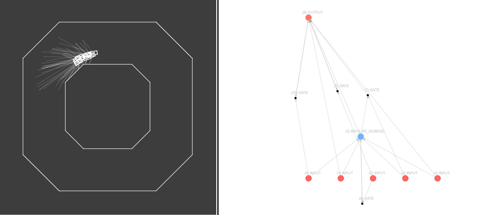
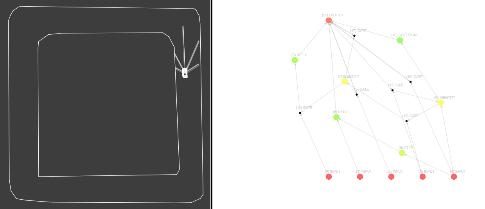
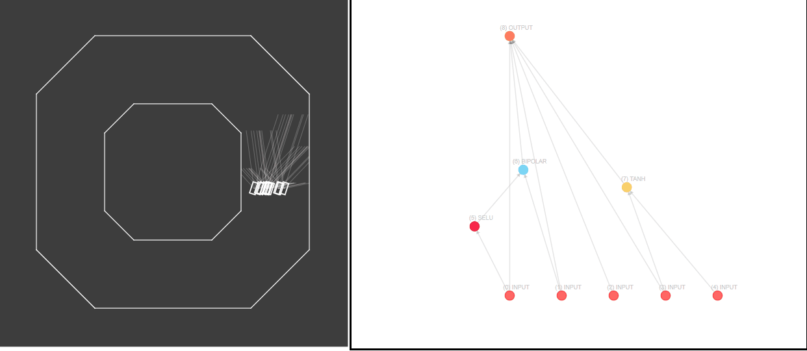

# Neuroevolution-Car

**Celem projektu jest pobawienie się neuroewolucją i sprawdzenie jak sobie poradzi z problemem autonomicznej jazdy w bardzo prostym środowisku**

[https://ath0m.github.io/Neuroevolution-Car/](https://ath0m.github.io/Neuroevolution-Car/)

## Symulator

Głównym elementem symulacji są samochodziki. Ich zadaniem jest przetrwać jak najdłużej na torze. W przypadku zetknięcia ze ściana są zatrzymywane, a ich punkty przestają być naliczne. Podstawową wiedzę o świecie czerpią z 5 czujników odelgłościowych o różnych długościach i ustawionych pod różnymi kątami. Wartości z czujników są wejściem do sieci neuronowej, a wyjście traktowane jest jako kąt skrętu. Samochody w obecnym projekcie mają stałą prędkość. 

Punkty przyznawane są za aktywny czas przebywania na torze, czyli za każdą kolejną klatkę w ruchu. Wcześniej wykorzystywałem do tego checkpointy w formie promieni rozłożonych równomiernie po planszy, jednak system ten jest zbyt dyskretny i skomplikowany w zastosowaniu dla trudniejszych torów.

Czujniki podają wartość minimalną ze swojej długość i odległości do najbliższej ściany

Samochód ma stałą prędkość i mówi jedynie o jaki kąt chciałby skorygować swoją obecną trasę. Samochody nie widzą siebie nawzajem.

## Panel

Opis funkcji panelu

* **speed** - służy do ustawiania prędkości symulacji (przydatne w trakcie ewolucji)
* **generation** - numer obecnej generacji
* **best car score** - najlepszy wynik spośród obecnie aktywnych samochodów
* **highest world score** - najlepszy ogólny wynik na danym torze w trakcie całej ewolucji
* **timer** - licznik czasu (jeśli populacja nie wymrze do danego czasu to jest siłowo ewoluowana)
* **track** - wybór torów
* **model** - wybór gotowych modeli do załadowania `T` (current oznacza najlepszy z całej ewolucji)

Skróty klawiszowe

* `N` - wymuszenie kolejnej ewolucji
* `F` - możliwość przybliżenia i śledzenia najlepszego obecnie pojazdu
* `P` - zatrzymywanie i starowanie symulacji
* `D` - pokazywanie informacji pomocniczych
* `S` - zapisywanie obecnie najlepszego modelu w formacie json. Załadowanie go do symulatora wymaga modyfikacji pliku `models.js`
* `R` - rozpoczęcie ewolucji od początku
* `T` - załadowanie wybranego modelu i uruchomienie przejazdu
* `V` - pokazanie grafu sieci neuronowej najlepszego z aktywnych samochodów
* `W` - pokazanie grafu sieci neuronowej najlepszego modelu z całej ewolucji
* `E` - wyczyszczenie grafu (przyspiesza symulację)

## Algorytm NEAT

Ogólną ideą neuroewolucji jest generowanie sieci neuronowych włącznie z parametrami, topologią przy pomocy algorytmów ewoluchnych. 

Do samej neuroewolucji skorzystałem z biblioteki **[Neataptic](https://wagenaartje.github.io/neataptic/)**. Wykorzystałem ją, ponieważ opiera się na dokumencie [Evolving Neural Networks through Augmenting Topologies ](http://nn.cs.utexas.edu/downloads/papers/stanley.ec02.pdf), z którego planowałem skorzystać.

Wygenerowana sieć różni się od takich które znamy, a bardziej przypomina graf przepływów. Ogólnie istotniejsze są same komórki, a nie warstwy.

Opis genotypu znajduje się w rozdziale 1: [Instinct: neuro-evolution on steroids](https://towardsdatascience.com/neuro-evolution-on-steroids-82bd14ddc2f6)

Sam algorytm opiera się bezpośrednio na algorytmie **SGA**

##### Populacja początkowa:

Losowa sieć o stałej liczbie wejść i wyjść

##### Funkcja oceny:

Liczba iteracji symulatora do czasu kolizji samochodu z otoczeniem. Chcemy tę wartość maksymalizować

**Selekcja:**

Początkowa część populacji wybierana jest na zasadzie elitaryzmu, a reszta przy użyciu ruletki

##### Krzyżowanie:

Opis znajduje się w rozdziale 2: [Instinct: neuro-evolution on steroids](https://towardsdatascience.com/neuro-evolution-on-steroids-82bd14ddc2f6)

**Mutacja**:

Dokładny opis mutacji znajduje się w rozdziale 3: [Instinct: neuro-evolution on steroids](https://towardsdatascience.com/neuro-evolution-on-steroids-82bd14ddc2f6)

## Model

Ewolucja zaczyna się od prostej losowej sieci o 5 wejściach i 1 wyjściu.

**Operacje mutacji**:

* dodawanie nowych komórek
* dodawanie połączeń pomiędzy komórkami
* dodawanie bramek (**gate**, dodatkowe połączenia)
* modyfikacja wag
* modyfikacja *bias*
* zmiana funkcji aktywacji
* usuwanie komórek, połączeń, bramek

**Dodatkowe parametry:**

* rozmiar populacji: 20
* prawdopodobieństwo mutacji: 0.5
* elitaryzm: 5

Jednym z najwiekszych wyzwań w przypadku generowania sieci neuronowej jakie napotkałem jest potrzeba interpretowania wyjścia. Ze względu na dynamiczne zmiany w strukturze sieci zmienia się dziedzina wyjścia, którą w moim przypadku trzeba przełożyć na kąt skrętu. Rozwiązuje to przy pomocy odpowiedniego przycynania wartości wynikowej i rzutowania na inną skalę.

## Wyniki

### Tor 1

##### Model - Track 1

Model trochę gorzej radzi sobie na torze 2 i nie radzi sobie na torze 3.

### Tor 2

##### Model - Track 2

Model radzi sobie również na torze 1, ale nie radzi sobie na torze 3, gdzie występują szybsze zakręty oraz zakręty w drugą stronę.

### Tor 3

##### Model - Track 3

Model dobrze radzi sobie również na torze 1 i 2.

### Wpadka

Jeśli damy modelowi zbyt dużo swobody wykorzysta to przeciwko nam :D. Rozwiązaniem tego jest ograniczenie maksymalnych kątów skrętu.

## Podsumowanie

Neuroewolucja poradziła sobie z postawionym przed nią problemem. Całkiem skutecznie generowała modele pozwalające przejechać zadaną trasę. Zadowalające jest to, że umiejętność przejechania trudniejszej trasy, pozwala na pokonanie innych. Dodatkowo można zwrócić uwagę na poziom skomplikowania sieci w zależność od trudności problemu. 

## Bibliografia

1. [**Evolving Neural Networks through Augmenting Topologies**](http://nn.cs.utexas.edu/downloads/papers/stanley.ec02.pdf), Kenneth O. Stanley, Risto Miikkulainem
2. [**Instinct: neuro-evolution on steroids**](https://towardsdatascience.com/neuro-evolution-on-steroids-82bd14ddc2f6), Thomas Wagenaar
3. [**Neataptic**](https://wagenaartje.github.io/neataptic/)